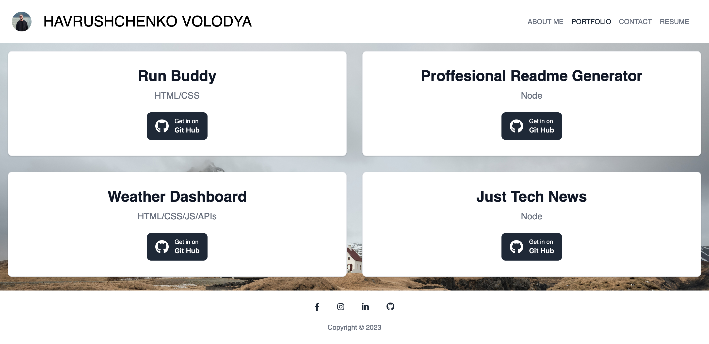

# Dream Trip
  ## License: MIT
  ### 
  ## Table of Contents
  - [Description](#description)
  - [Screenshots of Application](#screenshots-of-application)
  - [Github Link](#github-link)
  - [Contributors](#contributors)

  ## Description:
  A portfolio site using React Single Page Application.

  ## Screenshots of Application

  About Me

  

  Portfolio

  

  Contact 

  

  Resume

  

  ## GitHub Links
  - https://github.com/Havrushchenko/dream-trip

  ## Contributors:
  - Github: https://github.com/Havrushchenko

  This README.md is made with a [Proffesional Readme Generator](https://github.com/Havrushchenko/proffesional-readme-generator).
